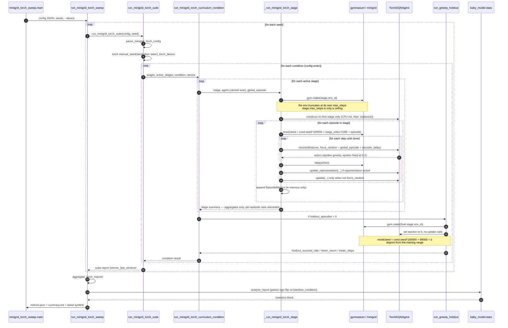
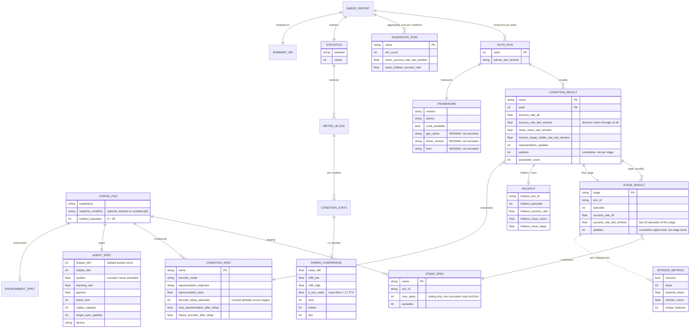

# Experiment Pipeline: Control Flow and Artifact Model

Date: 2026-08-23 JST

Reference for what actually executes in the PyTorch AD/DA lane and what is
persisted afterwards. Written from the code at `56f0c3d` plus the v2.46 run
artifacts, not from the protocol documents.

Both Mermaid diagrams below were rendered with `mmdc` 11.16.0 to confirm they
parse.

## Sequence: one sweep

Three properties of this flow drive most of the verification findings:

- **The agent is created once per condition and carried across stages.** The
  curriculum is a single continuous training run, so `decoder_delay_episodes` is
  counted on a *global* episode index, not per stage.
- **Randomness is entirely CPU-side.** `torch.manual_seed(seed)` seeds weight
  initialization, which happens before `.to(device)`; there is no dropout and no
  CUDA RNG draw anywhere. Action selection and replay sampling both come from
  one `random.Random(seed)` instance inside the agent. Nothing in the loop
  consumes a device-dependent random stream.
- **`EpisodeMetrics` never leaves memory.** Only stage-level aggregates are
  written, so no artifact contains a learning curve.

## Entity model: what a run persists

Two schema facts worth stating plainly, both confirmed against the v2.46
artifacts:

- `updates` on a `STAGE_RESULT` is the agent's **cumulative** counter at the end
  of that stage, not the number of updates performed in it. Reading the
  per-stage column as stage-local overstates late stages.
- `FRAMEWORK` records the torch version and the device string but **not** the
  GPU model, driver version, or host. Every worker/GPU claim in
  `docs/experiments/` was transcribed by hand into prose and cannot be checked
  against the artifact.
