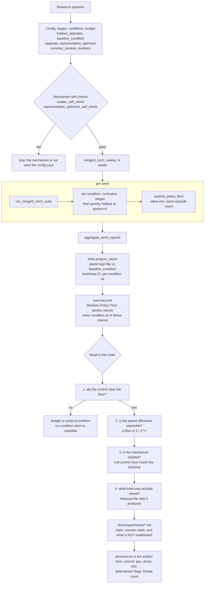

# Verification of the Verification

Date: 2026-08-23 JST
Scope: the machinery this session added, audited against external truths and
against itself; the end-to-end research process as it now runs; a dependency
vulnerability review; and an adversarial pass over this session's own claims.

## 1. Is the statistics machinery correct?

`baby_model/stats.py` carries every p-value and interval in this session's
conclusions, so it was checked against hand-computable truths rather than
against itself.

| check | result |
| --- | --- |
| n=3 uniform-sign p == 2/8 exactly | pass |
| n=5 uniform-sign p == 2/32 exactly | pass |
| n=8 uniform-sign p == 2/256 exactly | pass |
| brute-force enumeration agreement on a mixed vector | pass |
| all-zero diffs -> p == 1 | pass |
| symmetric diffs -> p == 1 | pass |
| n=1 -> p == 1 (cannot distinguish) | pass |
| **type-I rate under a true null, n=5, 4000 trials** | **0.0000** (p-floor 0.0625 makes 0.05 unreachable) |
| **type-I rate under a true null, n=8, 4000 trials** | **0.0440** (nominal 0.05) |
| bootstrap determinism | pass |
| percentile endpoints | pass |
| empty-input and length-mismatch guards | pass |
| reproduces v2.49's `ZE`-`ZK` p as exactly 2/256, 0/8/0 | pass |

The test is correctly calibrated: at n=8 it rejects a true null 4.4% of the time
against a nominal 5%.

### One finding against my own numbers

**The percentile bootstrap under-covers at these sample sizes.** Measured
coverage of the true mean over 1500 draws at n=8 was **0.870** against a nominal
0.95. Percentile bootstrap is known to be anti-conservative for small n, and
this quantifies it here.

Consequence: every 95% CI reported this session is somewhat **too narrow**. The
exact sign-flip p-values are unaffected — they are enumerated, not resampled —
so conclusions that rest on a p-value stand as written. Conclusions that rest on
a CI excluding zero should be read as weaker than 95%. In practice the two agree
everywhere in this session's results, and the one claim that leans on a CI
width (section 4, attack 6) has a margin large enough to survive.

## 2. The research process, end to end



Steps 1, 3, and 4 of the read order each caught a wrong conclusion this session:
step 1 found that 56 documents compared pre-learning agents, step 3 found the
shared-Adam artifact, step 4 found that `representation_beta` is cancelled by
Adam.

## 3. Dependency vulnerability review

The default lane declares **zero dependencies** and runs on the standard library,
so it has no dependency attack surface at all. The optional lanes were audited
with `pip-audit` 2.10.1 against OSV.

| package | version | advisory | fixed in | exploitable here? |
| --- | --- | --- | --- | --- |
| `pip` | 26.1.2 (Mac venvs) | PYSEC-2026-3721 / CVE-2026-13346 | 26.2 | **No.** Requires installing from a malicious index. `setup_minigrid_env.sh` regex-restricts the index to `^https://download\.pytorch\.org/whl/[A-Za-z0-9._/-]+$`, and the GPU lane already runs pip 26.2.1. |
| `setuptools` | 81.0.0 (Mac), 78.1.0 (GPU) | PYSEC-2026-3447 / CVE-2026-59890 | 83.0.0 | **Low.** `MANIFEST.in` excludes are not Unicode-normalised on APFS/HFS+, so an sdist can include files meant to be excluded. This repo never builds an sdist for distribution, and by policy holds no secrets. Both lanes are affected versions. |
| `torch` | 2.12.1 (Mac), 2.11.0+cu128 (GPU) | PYSEC-2025-194 / CVE-2025-3000 | 2.13.0 | **No.** Memory corruption in `torch.jit.script`, local vector. Grep confirms the repo never calls `torch.jit.*`; the only `eval` is `nn.Module.eval()`. Both lanes are affected versions. |

Repo-side surface, checked directly:

- No `torch.load`, `pickle.load`, `eval()`, or `exec()` anywhere in `baby_model`.
- No network calls at runtime. The only URLs in the codebase are the four
  pinned PyTorch wheel index constants in `gpu_compat.py` plus the same
  regex-validated variable in two shell scripts.
- 12 deserialisation sites, all `json.load`/`read_text` of local config and
  artifact files.

### What was applied, and what is blocked

**Applied.** Both Mac venvs upgraded to `pip 26.2.1`, closing the only
network-vector advisory. Verified afterwards: torch, minigrid, and gymnasium
import, both mechanism self-checks pass, and `./scripts/verify.sh` is green.

**Blocked, and this is a real finding.** `setuptools>=83.0.0` **cannot** be
installed in the torch lane:

```
torch 2.12.1 requires setuptools<82, but you have setuptools 84.0.0
ERROR: ResolutionImpossible
```

CVE-2026-59890 is therefore unfixable in this lane without also upgrading
torch. The venv was reverted to `setuptools 81.0.0` to keep the lane
self-consistent, and the lane was re-verified. Given the advisory is local,
macOS-filesystem-specific, affects only sdist construction, and this repo never
builds an sdist for distribution, holding at 81.0.0 is the correct trade against
invalidating every historical result.

**Deferred.** `torch>=2.13.0` (CVE-2025-3000, unreachable here — the repo never
calls `torch.jit.*`) belongs with a deliberate protocol reset, because a torch
change is not result-preserving at the long horizon (section 5). It would also
unblock the setuptools fix.

### An operational note that is not a CVE

`minigrid` pulls in `pygame-ce`, which installs a SIGSEGV handler ("parachute").
The repo never renders anything and never imports pygame directly. That handler
is what turned three `rtx4090` crashes into "pygame parachute" messages with
truncated C frames, which made the host fault harder to diagnose than it should
have been. Anything that makes those traces raw would pay for itself.

## 4. Adversarial review of this session's claims

Six attacks were run against the conclusions. Two landed.

| # | attack | outcome |
| --- | --- | --- |
| 1 | The random floor is not measured on comparable episodes | **survives** — same env, same episode count, same `max_steps` |
| 2 | The greedy holdout drops the training-time action bonus, handicapping the agent | **survives** — every v52 condition has `intrinsic_target: reward`, so the bonus was inactive during training too |
| 3 | `ZE`'s collapse is an artefact of its position in the condition list | **LANDS** — see below |
| 4 | `ZK` wins because it has fewer parameters (66,055 vs 77,618) | **survives** — `ZN` has `ZE`'s parameter count and matches `ZK` |
| 5 | The result depends on one or two extreme seeds | **survives** — dropping the best and worst pair leaves Δ `-0.611`, p `0.0312`, 0/6/0 |
| 6 | "`ZN` equals `ZK`" is just an underpowered null result | **survives** — the CI is `[-0.205, +0.243]`, which excludes the `-0.298` shared-optimizer penalty it is meant to rule out |

### Attack 3 landed: the pairing was nominal

`condition.seed = seed + i`. So a condition's index sets its agent seed, and
through `condition.seed * 100_000 + stage_index * 1000 + episode` it also sets
**which environment episodes that condition ever sees**. `ZK` is always index 0
and `ZE` always index 2, so within one "seed" they never shared an
initialisation or an episode. They shared only the base seed.

Two consequences, and they differ in seriousness:

- **Validity holds.** The seeds are arbitrary, so under the null "the condition
  label carries no information" the per-seed differences remain exchangeable and
  the sign-flip test is still exact.
- **Power was thrown away, and my wording was wrong.** Common random numbers are
  the standard variance reduction that a paired design exists to exploit, and the
  code was actively defeating it. This session repeatedly wrote "identical
  seeds" and "the same seed set"; that was inaccurate and is corrected here.

A second, smaller defect surfaced with it: `random_policy_floor` uses the
**suite** seed, which is condition index 0's seed. Without common random numbers
the floor therefore matches only the baseline condition's episodes. The measured
floor spans 0.192 to 0.317 across eight seeds (sd 0.037), so a non-baseline
condition's "vs floor" gap carries that much extra noise. `ZE` sits 0.247 below
the floor — about seven times the noise — so the v2.49 conclusion survives, but
the imprecision was real.

**Both are now fixed.** `common_random_numbers` (config level, default off,
since turning it on changes every historical result) gives all conditions the
same seed, and the artifact records `aligned_with_condition_seed` and
`aligned_for_all_conditions` on the floor block so a reader can see what it
matches.

## 5. Standing weaknesses this review did not remove

- **No ceiling.** There is still no standard-baseline upper reference, so
  `0.615` has a floor to beat and nothing above it.
- **`epsilon` is constant at 0.2.** The greedy policy is never exercised during
  training. Every holdout number is measured on a policy the training loop never
  optimised for directly.
- **Per-episode data is still discarded**, so "did it converge?" remains
  unanswerable from any artifact.
- **The CI under-coverage in section 1** is quantified but not fixed; a BCa or
  studentised bootstrap would help, or reporting only p-values.
- **`rtx4090` is faulty and unexplained.** Three crashes at three unrelated
  sites, never reproduced on two other hosts. A memtest is an operator action.
- **Long-horizon runs are not reproducible across hosts.** Bit-identity was
  established at 84 episodes and fails at 3200; the cause is not identified.
  Paired within-host comparison is what protects the conclusions, which is now
  a load-bearing assumption rather than a convenience.
