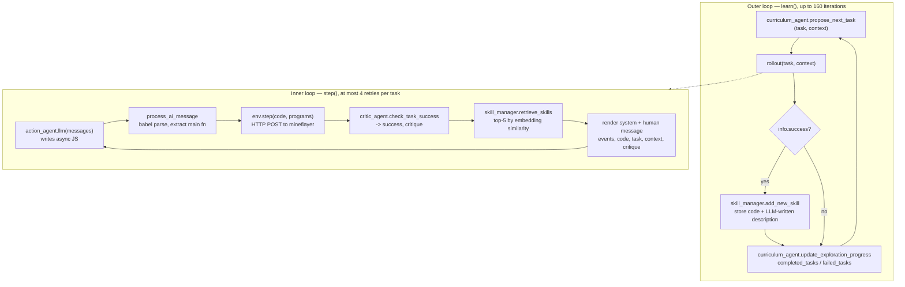

# Voyager (Minecraft × LLM) — System Analysis

Date: 2026-08-23 JST
Source: `~/ghq/github.com/MineDojo/Voyager` at `55e45a8`, read directly.
Written because the same question baby-model is asking — can a learning
*schedule* be produced rather than hand-written — is what Voyager's curriculum
agent does in a much richer environment.

## 0. What was and was not found locally

No Minecraft-related repository exists under `~/work` (100+ repos), `~/ghq`,
`~/Documents`, or `~/Desktop`. Searched by directory name (voyager, minedojo,
minerl, mineflayer, minecraft, steve, jarvis, odyssey, plan4mc) and by content
in `package.json` / `requirements*.txt` / `pyproject.toml`. The nearest
neighbour, `~/work/ai-game-factory`, is a deterministic grid-combat evaluation
runner with no Minecraft dependency. If a local copy exists it is on another
fleet node.

## 1. Shape of the system

Voyager is small: **2,868 lines of Python** across 14 files, plus a JavaScript
side that does all the actual acting. The Python never touches Minecraft. It
writes JavaScript, posts it to a local HTTP server, and reads back an event log.

```
voyager/voyager.py            411   orchestration, the two nested loops
voyager/agents/curriculum.py  498   proposes the next task  (the auto-curriculum)
voyager/agents/action.py      280   writes JS code for the task
voyager/agents/critic.py      138   judges success from the event log
voyager/agents/skill.py       127   stores and retrieves skills
voyager/env/bridge.py         189   HTTP bridge to the mineflayer process
```

Four LLM roles, each with its own prompt file in `voyager/prompts/` and its own
model setting. Defaults from `voyager.py`:

| role | model | temperature | notes |
| --- | --- | ---: | --- |
| action agent | `gpt-4` | 0 | writes the JS program |
| curriculum agent | `gpt-4` | 0 | proposes the next task |
| curriculum QA | `gpt-3.5-turbo` | 0 | self-asks/answers questions about the world |
| critic agent | `gpt-4` | 0 | success/failure + critique |
| skill manager | `gpt-3.5-turbo` | 0 | writes each skill's description for retrieval |

`max_iterations: 160`, `action_agent_task_max_retries: 4`,
`skill_manager_retrieval_top_k: 5`.

## 2. The two loops



**Outer loop** = what to learn next. **Inner loop** = get this one task done,
with the critic's critique fed back into the next attempt's prompt. A task that
succeeds becomes a permanent skill; the loop never rolls back.

## 3. The four mechanisms, concretely

### 3.1 Automatic curriculum

`propose_next_task` is not purely an LLM call. It is a small policy with hard
rules first:

- `progress == 0` → the task is hard-coded to `"Mine 1 wood log"`.
- `inventoryUsed >= 33` → hard-coded to deposit into a chest, or place/craft one.
- otherwise → ask GPT-4, given a 14-field observation.

The observation the curriculum sees is explicit:

```
context, biome, time, nearby_blocks, other_blocks, nearby_entities,
health, hunger, position, equipment, inventory, chests,
completed_tasks, failed_tasks
```

Note the last two: **the curriculum is conditioned on its own success and
failure history**, which is what makes it a curriculum rather than a task
sampler. There is also a `warm_up` schedule that gates which observation fields
are shown as `progress` grows — early iterations see less.

A QA sub-agent (`curriculum_qa_step1_ask_questions` /
`step2_answer_questions`) generates and answers its own questions about the
world, cached in `qa_cache.json` with a Chroma vector store so the same question
is not re-asked.

### 3.2 Skill library

- A skill is a **JavaScript function**, stored as source, not weights.
- On success, `skill_manager.generate_skill_description` has an LLM write a
  one-line description; the *description* is embedded (OpenAI embeddings) and
  put in a Chroma collection keyed by program name.
- `retrieve_skills(query)` embeds `context + chat-log summary` and returns the
  **top 5** skills by similarity — as raw code, pasted into the next system
  message.
- Re-learning an existing skill overwrites the entry and versions the file
  (`nameV2.js`, `nameV3.js` …).

So the "memory" is retrieval over natural-language descriptions of code, and the
"transfer" is literal source-code reuse in the prompt. No gradient anywhere.

### 3.3 Iterative prompting with a critic

`critic_agent.check_task_success` reads the **event log** (inventory, status,
chat) and returns `(success: bool, critique: str)`. The critique goes straight
into the next attempt's human message alongside the previous code and the
events. Failure is therefore a text signal, not a scalar.

A `manual` mode exists where a human answers instead of GPT-4 — a useful
reminder that the critic is the weakest link and they knew it.

### 3.4 Environment bridge

`bridge.py` spawns `voyager/env/mineflayer/index.js` as a subprocess and talks
to it over HTTP (`/start`, `/step`, `/stop`). Generated code is executed inside
that Node process against the `mineflayer` bot API. There are 11 hand-written
JS control primitives (`mineBlock`, `craftItem`, `smeltItem`, `killMob`,
`placeItem`, `useChest`, `exploreUntil`, `shoot` …) that the LLM composes; a
parallel `control_primitives_context/` holds trimmed versions used as prompt
context rather than for execution.

**The action space is "a JavaScript program", not a keypress.** That is the
single biggest architectural decision in the repo, and it is why an LLM can
drive it at all.

## 4. Honest limits, from the code

- **The critic is an LLM reading a log.** Success is whatever GPT-4 says it is
  from inventory diffs and chat. There is no environment-provided reward and no
  independent verification. Everything downstream — the curriculum's
  `completed_tasks`, what enters the skill library — inherits that judgement.
- **No held-out evaluation.** Nothing measures the agent on tasks it did not
  propose to itself. The reported progress metric is the count of tasks the
  system itself decided it completed.
- **No baseline in the loop.** There is no random or scripted control run inside
  the codebase.
- **Skill retrieval is unvalidated.** `retrieval_top_k = 5` is a constant; there
  is no measurement that retrieved skills help versus a random five.
- **Cost is the hidden variable.** Four GPT-4 roles, up to 160 iterations, up to
  4 retries per task, with the full skill code pasted into each prompt.
- **`skill_library/trial1..3`** ship three recorded runs. Three trials is the
  same seed count that the baby-model audit found unable to reach p < 0.05.

None of this makes the result uninteresting — it is a genuinely open-ended agent
and the skill-library idea works. It means the *evaluation* has the same shape
of gap that the baby-model audit found: a self-judged metric, no floor, no
ceiling, few trials.

## 5. What transfers to baby-model

| Voyager mechanism | baby-model equivalent | status |
| --- | --- | --- |
| Curriculum conditioned on completed/failed task history | stage list is a static JSON array | **the gap** — baby-model's schedule cannot respond to what the agent has learned |
| Warm-up gating of observation fields by progress | `decoder_delay_episodes`, a fixed integer | same idea, but open-loop |
| Critic emits a *critique*, not a scalar | scalar reward only | not applicable at this scale |
| Skill library as retrievable source | none | not applicable to a 65k-parameter DQN |
| Task proposal as the object being learned | hand-written conditions `ZK`/`ZE`/`ZI` | **the gap** |

The transferable idea is exactly one: **make the schedule a function of the
agent's own success history instead of a constant.** Voyager does it with an
LLM reading `completed_tasks` / `failed_tasks`; the RL-native version of the
same move is learning-progress-driven curriculum (IAC) or a regret-based
teacher (TeachMyAgent, dcd), both already listed in
`docs/research/prior-art-and-learning-order.md`.

The non-transferable part is the reason Voyager works at all: a code-level
action space and a pretrained model carrying all the priors. baby-model has
neither, which is the same scale asymmetry noted in that document — Voyager
borrows its outer-loop subsidy from GPT-4's pretraining rather than paying for
it.

## 6. Adjacent repos not cloned

Named for completeness, not read: `MineDojo/MineDojo` (benchmark + internet-scale
knowledge base), `openai/Video-Pre-Training` (VPT, behavioural cloning from
video), `minerllabs/minerl` (competition environment), and the later agent lines
STEVE-1, JARVIS-1, Plan4MC, Odyssey, Optimus-1. Say the word and any of these
gets the same treatment.
